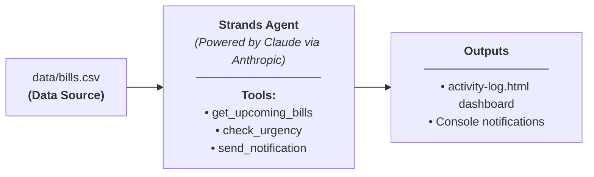

# ⚡ BillWatch: Autonomous Bill Tracking & Reminder Agent

> **AWS "Agents for Humans" Hackathon Submission**  
> Built with the **Strands Agents SDK** to automate routine financial tracking and eliminate missed payment penalties.

---

## 🎯 Problem It Solves

Managing recurring household, personal, and business expenses is a tedious, repetitive chore. People frequently miss payment deadlines or incur late fees simply because bill reminders get lost in overflowing email inboxes or require constant manual spreadsheet reviews.

**BillWatch** eliminates this friction. As an autonomous AI agent, BillWatch:
- Continuously inspects upcoming obligations from your bill database.
- Evaluates urgency thresholds intelligently (distinguishing between **overdue**, **due soon**, and **fine**).
- Dispatches targeted notifications **only when action is needed**, staying completely silent when all bills are in order.
- Provides specific, actionable details (exact amount, due date, payment status, and autopay indicator) so you know instantly what needs attention.

---

## 👥 Who It's For

- **Busy Professionals & Freelancers**: Prevent late fees and credit score impacts across multiple recurring utility and subscription services.
- **Families & Households**: Keep shared bills, utilities, and rent synchronized without manual check-ins.
- **Small Business Owners**: Track invoice payments and operational renewals autonomously in the background.

---

## 🏗️ Architecture & Technology



- **Strands Agents SDK (`strands-agents`, `strands-agents-tools`)**: Provides the tool-calling harness, agent loop, and LLM orchestration.
- **Direct Anthropic Integration (`AnthropicModel`)**: Powers intelligent agent reasoning using Claude 3.5 Sonnet without requiring complex cloud routing.
- **Pandas Data Pipeline**: Fast local ingestion and querying of bill registries.
- **Dual Execution Modes**: Instant on-demand audit (`--once`) or continuous background daemon monitoring (`--loop`).

### Agent Tools (`tools.py`)
1. `get_upcoming_bills()`: Ingests `data/bills.csv` with pandas and returns bill records.
2. `check_urgency(bill: dict)`: Compares the bill due date against today's date and classifies as `"overdue"`, `"due_soon"` (within 3 days), or `"fine"`.
3. `send_notification(message: str)`: Formats and outputs real-time timestamped alerts to the user.

---

## 🚀 Quickstart & Setup

### 1. Prerequisites
- Python 3.10+ (tested on Python 3.12)
- Virtual environment tool (`venv`)

### 2. Installation

Clone or open the repository, then navigate to the project directory:

```bash
cd billwatch
```

Create and activate a virtual environment:

```bash
# On Windows (PowerShell)
python -m venv venv
.\venv\Scripts\Activate.ps1

# On macOS / Linux
python3 -m venv venv
source venv/bin/activate
```

Install dependencies:

```bash
pip install -r requirements.txt
```

### 3. Environment Configuration

Copy the example environment configuration:

```bash
# On Windows
copy .env.example .env

# On macOS / Linux
cp .env.example .env
```

Open `.env` and add your Anthropic API key:

```env
ANTHROPIC_API_KEY=sk-ant-api03-...
```

*(Note: If no API key is configured, BillWatch runs in simulated tool-calling mode for zero-friction demo reviews).*

---

## 💻 Running BillWatch

### Mode 1: Single Check (`--once`)
Performs a single evaluation cycle of all bills, dispatches notifications for overdue or due soon items, and exits.

```bash
python agent.py --once
```

**Sample Output:**
```text
[2026-08-26 10:22:05] checking bills...

--- BillWatch Autonomous Check ---
Loaded 6 bill records.
[2026-08-26 10:22:05] NOTIFICATION: [OVERDUE] Electric Utility of $145.50 is due on 2026-08-20 (Autopay: OFF). Status: unpaid.
[2026-08-26 10:22:05] NOTIFICATION: [OVERDUE] Internet Fiber of $85.00 is due on 2026-08-23 (Autopay: ON). Status: pending.
[2026-08-26 10:22:05] NOTIFICATION: [DUE SOON] Apartment Rent of $1850.00 is due on 2026-08-27 (Autopay: OFF). Status: unpaid.
[2026-08-26 10:22:05] NOTIFICATION: [DUE SOON] Water & Sewer Utility of $62.30 is due on 2026-08-28 (Autopay: OFF). Status: unpaid.
Check complete. Processed all bills.
```

### Mode 2: Continuous Background Daemon (`--loop`)
Runs autonomously in the background, logging `[timestamp] checking bills...` and re-evaluating every 60 seconds (or custom `--interval`):

```bash
python agent.py --loop
```

Custom interval (e.g. 30 seconds for quick live demos):
```bash
python agent.py --loop --interval 30
```

---

## 📊 Sample Data (`data/bills.csv`)

| Name | Amount | Due Date | Autopay | Status | Agent Action |
| :--- | :--- | :--- | :--- | :--- | :--- |
| **Electric Utility** | $145.50 | 2026-08-20 | False | unpaid | 🚨 Notified (Overdue) |
| **Internet Fiber** | $85.00 | 2026-08-23 | True | pending | 🚨 Notified (Overdue) |
| **Apartment Rent** | $1850.00 | 2026-08-27 | False | unpaid | ⚠️ Notified (Due Soon) |
| **Water & Sewer Utility** | $62.30 | 2026-08-28 | False | unpaid | ⚠️ Notified (Due Soon) |
| **Health Insurance** | $320.00 | 2026-09-05 | True | scheduled | 🔇 Silent (Fine) |
| **Cloud Storage** | $9.99 | 2026-09-15 | True | scheduled | 🔇 Silent (Fine) |

---

## 🛠️ Project Structure

```text
billwatch/
├── agent.py            # Strands Agent setup, Anthropic integration, and CLI runner
├── tools.py            # Strands tool definitions (@tool) for ingestion, urgency & alerts
├── activity-log.html   # Activity log & notification dashboard
├── data/
│   └── bills.csv       # Sample recurring bills dataset
├── requirements.txt    # Project dependencies (strands-agents, boto3, pandas, etc.)
├── .env.example        # Environment variable template
├── .gitignore          # Git exclusion rules
└── README.md           # Documentation and demo guide
```
